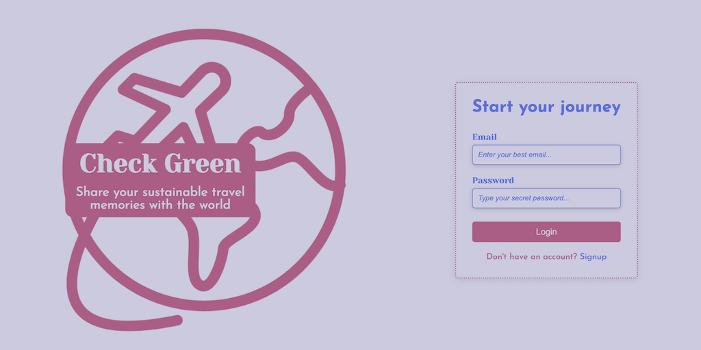
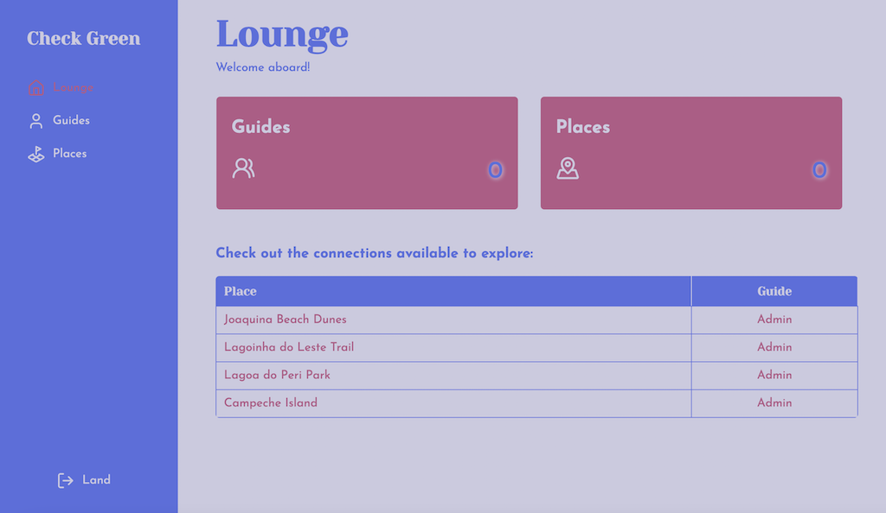

# Check Green

Final project for #teamTRIP #FuturoDEV FMT Module 2 - Front-End [Viagem365]

MVP application developed with React + Vite to connect travelers and share sustainable experiences through eco-friendly destinations


## Features

- Register and Login to manage travel data
- Extra validation to check email and CPF
- Forms to Add and Edit Locations 
- Zod and React Hook Form validations
- View Mode: dynamic list and an interactive map powered by Leaflet
- Database simulation using JSON-Server
- Address data with Axios, plus ViaCEP and OpenStreetMaps APIs
- Responsive pages for different screen sizes

## Running locally

Clone project

```bash
  git clone https://github.com/naty-c/Projeto-Check-Green_M2.git
```

Access folder

```bash
  cd check-green-M2S10
```

Install dependencies

```bash
  npm install
```

Start JSON-Server on port 3000

```bash
  npm run json-server
```

Run server

```bash
  npm run dev
```


## Libraries

 - [React Router DOM](https://reactrouter.com/en/main)
 - [React Hook Form](https://react-hook-form.com/)
 - [Zod](https://zod.dev/)
 - [Axios](https://axios-http.com/docs/intro)
 - [Lucide](https://lucide.dev/guide/packages/lucide-react)
 - [Leaflet](https://react-leaflet.js.org/)

## Technologies

- React + Vite
- JavaScript
- CSS Modules
- JSON-Server
## Color Palette

| Color               | Hexadecimal                                                |
| ----------------- | ---------------------------------------------------------------- |
| Royal Blue       |  #586fdf |
| Azure       |  #007bff |
| Mulberry Jam       |  #b65987 |
| Lavender Gray       |  #cbcae0 |


## Sample images

### Login



### Signup


### Dashboard



#### Places - List View


#### Places - Map View


#### Places - Form to add new places


#### Users


